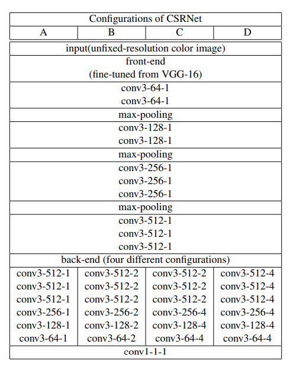
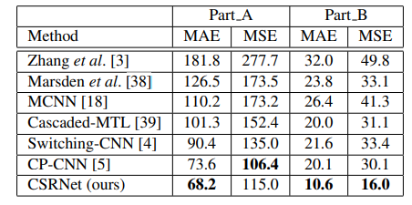
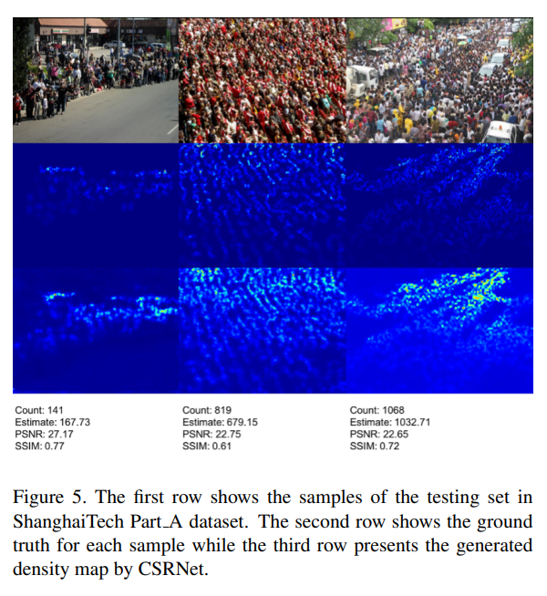

# 团队最新研究成果--CACrowdGAN

## 一、前言

随着城市人口的快速增长，人群计数已引起人们的广泛关注，并已成为视频监控和智能交通系统中的重要安全技术。人群计数是计算机视觉中一项有价值的技术，其在视频监控、交通监测、公共安全、城市规划以及建设智能商超等方面有着广泛应用。如监控某个人群易聚集区域的人群数目，防止由于人群密度过大，导致人群失控发生踩踏等事件。早期的工作使用低级特征作为区域描述符，然后使用分类器进行分类。受益于深度学习的最新进展，人群计数方法已经取得了巨大的成功。但是，由于存在诸如严重的咬合和背景混乱等问题，在实际应用中它仍然是一项具有挑战性的任务。现有的人群计数方法通常在真实密度图和生成的密度图之间具有高度的不一致性，导致检测结果不准确。

## 二、本文结构

解决上述挑战的最新技术主要是基于卷积神经网络（CNN），以实现准确的人群密度图生成和精确的人群计数。本文中尝试设计一种对抗训练策略，以使鉴别器能够区分难以分辨的密度图，同时引导生成器提供细粒度的高质量密度图。为实现此目的，本文提出了一个新的级联注意力生成对抗网络（CACrowdGAN），用于精确的人群计数。该网络使注意力驱动的鉴别器能够区分难以分辨的密度图，同时引导生成器生成细粒度的高质量密度图。CACrowdGAN由两个组件组成：注意力生成器和级联的注意力鉴别器。此网络的总体结构图如下图2-1所示：

注意力生成器具有注意力模块和密度模块，注意力模块是为生成器使用，用于关注输入图像的人群区域，而密度模块用于提供鉴别器的注意力输入。注意力模块以及密度图模块机构图如下图2-2所示，注意力模块使用VGG-16作为前端，并通过7个卷积层构建后端网络。密度模块采用注意力输入，并具有与注意力模块相同的体系结构。

级联的注意力鉴别器则用于合成输入图像中不同人群区域的细粒度信息，并计算每个像素的细粒度损失以训练生成器。级联的注意力鉴别器结构图如下图2-3所示，此结构中，注意力输入图像被下采样为，然后在通道维度上分别与注意力密度图和真实密度图串联，由鉴别器重建新的密度图。接着将重构的图输入到下一个鉴别器，每个鉴别器使用相同的体系结构，并且不与其他鉴别器共享参数。它从生成器中类似的前端和后端网络开始，然后是3个上采样层。MSE表示鉴别器模块中重构图和真实图之间的均方误差损失。

综上所述，本文有以下贡献：
1）通过在真实密度图和生成的密度图之间进行对抗训练，设计了一种用于人群计数的新颖框架。
2）在对抗训练中引入了注意力机制，并提出了一个级联的一般生成对抗网络（CACrowdGAN），以提供细粒度的高质量密度图来进行人群计数。具体来说，CACrowdGAN包含两个新颖的组件：注意力生成器和级联注意力鉴别器。
3）进行了全面的研究，以评估提出的CACrowdGAN。实验结果表明，提出的CACrowdGAN明显优于其他最新的人群计数方法。

## 实验结果总结
将本文中提出的CACrowdGAN在五个流行的人群统计数据集（ShanghaiTech，WorldEXPO’10，UCSD，UCF_CC_50和UCF_QNRF）上进行实验。使用MAE，PSNR和SSIM将生成的密度图与真实结果进行比较。如下图3-1所示：（a）显示了ShanghaiTech数据集中测试集的样本。（b）表示每个图像的真实人头位置，而（c）是由头部位置生成的真实密度图。（d）是通过二值化实况密度图的注意力掩码图。（e），（f），（g）和（h）分别是CSRNet，CSRNet + GAN，CSRNet + Attention和CSRNet + Attentional GAN生成的密度图，证明了该方法在复杂场景中的有效性和鲁棒性。

+ Aichun Zhu,  Zhe Zheng,  Yaoying Huang,  Tian Wang ,  Jing Jin,  Fangqiang Hu, Gang Hua, and Hichem Snoussi. "CACrowdGAN: Cascaded Attentional Generative Adversarial Network for Crowd Counting," in IEEE Transactions on Intelligent Transportation Systems, doi: 10.1109/TITS.2021.3075859.

# 经典算法介绍 - CSRNet

## Introduction

It is common to have sizeable crowds in specific events or scenarios(such as video surveillance, traffic control and sport events), and crowd counting from images or videos becomes crucial for applications to public safety. Estimation for crowd counts is via detecting the body or head in early stage. Then, learning a map from local or global handcrafted feature had used in some methods. In recent years, the improvement of accuracy of crowd counting is an serious problem. And the popular solution is density map that values are summed to give the count of crowd within the image. However, it still remains a challenging task for generating accurate crowd density map and performing precise crowd counting for highly congested scenes due to the exit of background noises, occlusions, and non-uniform distribution.  

Recently, researchers have proposed various improved algorithms and models based on deep neural networks(DNN) for generating better density map and have better performance in crowd counting. A number of multi-scale architectures have proposed to handle scale variation on congested scene. They have achieved high performance through multiple networks to integrate information of multiscale features and its performance is restricted by the number of columns or branches. Besides, these architectures containing several columns of CNN or several branches, have two disadvantages when networks go deeper: cost a large amount of training time and produce non-effective branches. A contextual pyramid CNN(CP-CNN) incorporates global and local contextual information to estimate context at various levels for achieving lower count error and better quality density maps. This method takes the spatial distribution of crowd into account through embedding contextual information which is essential for achieving further improvements. An ADCrowNet fuses the visual attention mechanism and deformable convolution scheme. This model achieve impressive result on account of attention mechanism have good performance in handling the occlusion problem and dilated convolutional filters can extract more features. However, there is still a gap between the density map generated by these methods and the ground truth, and there is room for improvement.  

## CSRNet Architecture

## Estimation errors on ShanghaiTech dataset

